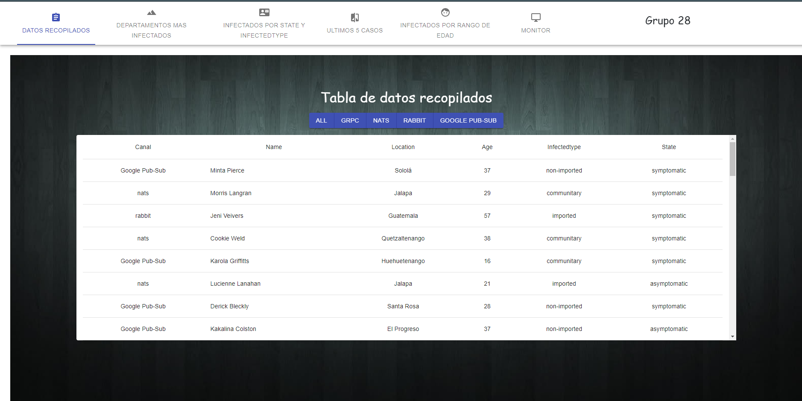
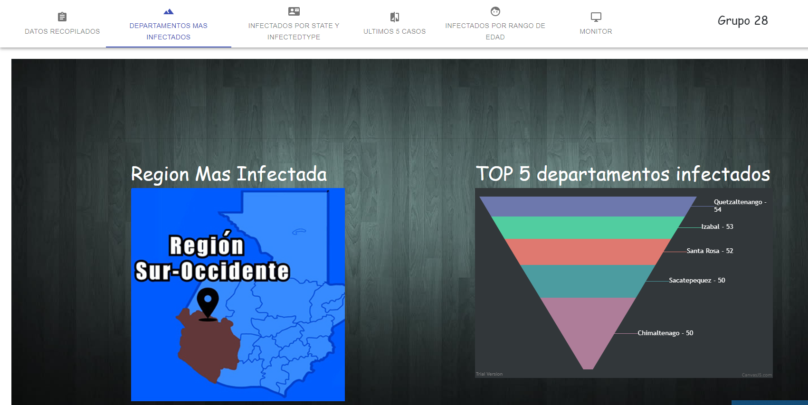
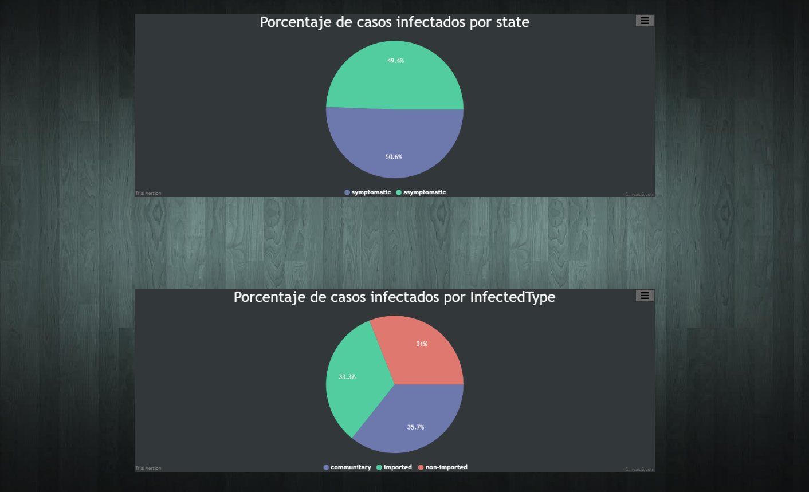
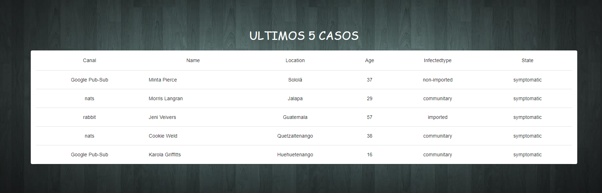
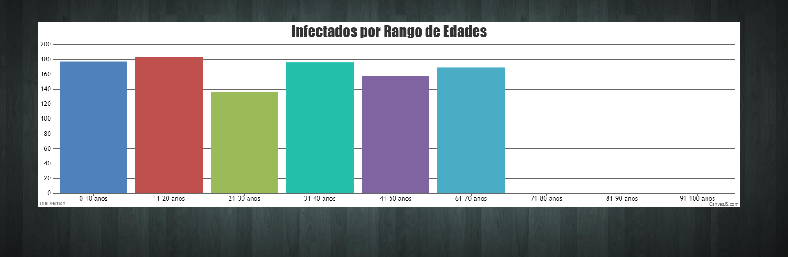
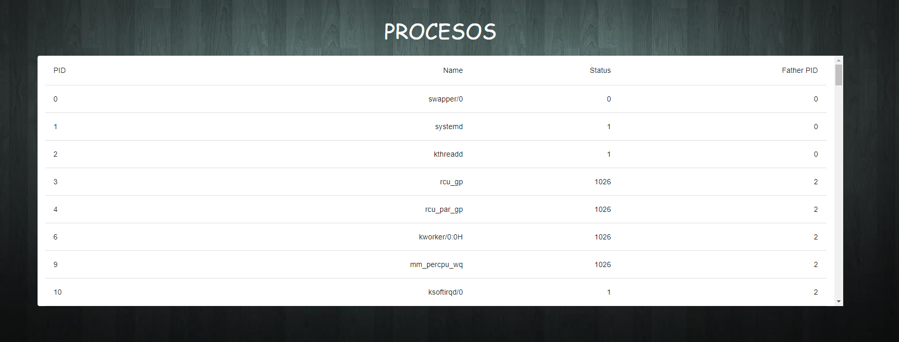

# MANUAL USUARIO
## Un recorrido por la aplicación.
# 

Al abrir la aplicación se muestra una barra de navegación donde se meustran todas las funcionalidades de la parte visual de la aplicación, comenzando por el apartado de *datos recopilados* se muestra una tabla con todos los datos que han llegado a la base de datos por los diferentes middleware de mensajeria. Se muestra el canal seguido por el mensaje, el nombre de la persona infectada, su ubicación, su edad, tipo de infección y su estado.

Se tiena la opción de poder filtrar los datos recopilados según la vía de mensajería que han seguido.

    

        Figura 1. Vista principal.
    

    

 

En la segunda vista se muestra una imágen de la región más infectada por la cantidad de casos de COVID-19, y luego una gráfica que muestra el TOP 5 de los departamentos infectados indicando la cantidad de habitantes infectados por departamento, este apartado brinda de forma gráfica un resumen de la situación actual del país.

    

        Figura 2. Resumen global del país.
    

    

 

En la siguiente apartado se muestra un gráfico que muestra la división entre el tipo de estado de los infectados y el tipo de infección de ellos, se tiene la opción de guardar las imágenes para un futuro uso o análisis.

    

        Figura 3. Resumen de tipo de infectados.
    

    

 

Si se desea tener información de último momento se cuenta con el apartado que muestra los ultimos 5 casos registrados, donde muestra todos los atributos mencionados en la vista principal.

    

        Figura 4. Últimos 5 casos de infección.
    

    

 

Este Reporte o seccion muestra a las personas infectadas separadas por rango de edad , el eje Y es la cantidad de infectados y el eje X vendria a ser el rango de edades.

    

        Figura 5. Infecciones por Rango de edades.
    

    

 

En esta seccion se puede monitoriar la ram , en su porcentaje de uso siendo este el eje Y y el eje X el tiempo transcurrido que comienza a partir de que se posiciono en esta vista y a la par se muestra un grafico circular que indica el uso de ram y el espacio libre que tiene.

    

        Figura 6. Monitor de Ram.
    

  

 

Los procesos se muestran en esta tabla ordenados por PID y se renderizan aunque no es tan notable por ser react pero por eso hay un numero que indica cuantos procesos se estan corriendo a la vez.

    

        Figura 7. Procesos.
    

    

 

